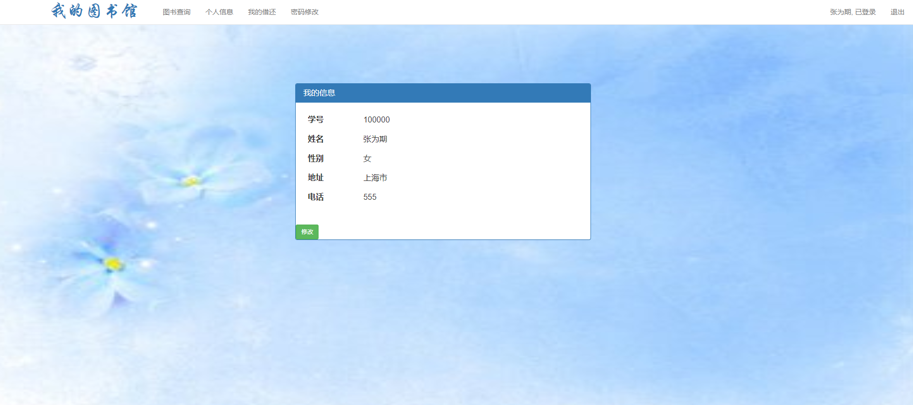

# LendBook
基于springboot+mybatis的借书还书系统。借还图书、个人信息修改；读者管理、图书管理、借还管理。

## 功能展示
### 1. 登录
读者、管理员两种身份

### 2. 读者系统
#### 2.1 首页

#### 2.2 图书查询
图书可供借阅

#### 2.3 个人信息

#### 2.4 我的借还

#### 2.3 密码修改

### 3. 管理员系统
#### 3.1 首页

#### 3.2 图书管理
显示图书

添加图书

#### 3.3 读者管理

#### 3.4 借还管理
只可删除已归还的记录

#### 3.5 密码修改

